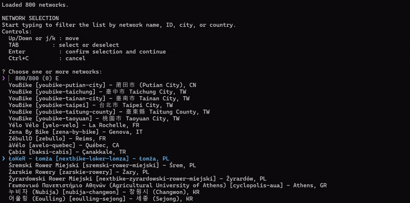

# CityBikes Historical Data Downloader

Interactive Python tool for discovering and downloading historical CityBikes network datasets in Parquet format from the CityBikes archive.

The tool allows users to:

- Browse and search available bike-sharing networks.
- Select one or more networks interactively.
- View available historical date ranges before downloading.
- Download historical monthly Parquet files.
- Resume downloads safely.
- Optionally merge monthly files into a single Parquet dataset.
- Generate a download manifest for reproducibility.



## Features

### Interactive Network Selection

Search networks by:

- Network ID
- Network name
- City
- Country

The network list is visible immediately and filters live while typing. Multiple networks can be selected in the same session.

Example search:

```text
gira
```

Possible matches:

```text
AlGira [algira] - Almeirim, PT
Gira [gira] - Lisbon, PT
```

### Automatic Date Discovery

After confirming the selected networks, the tool scans the historical archive and displays the available date range before asking the user to choose an interval.

Example:

```text
AVAILABLE DATA
  From : 2020-01
  To   : 2026-07
  Total months available: 79

Start month [2020-01]:
End month   [2026-07]:
```

Press Enter to accept the displayed default start or end month.

### Resume-Safe Downloads

Files that already exist locally and have the expected size are skipped automatically. If an existing file has an unexpected size, the tool downloads it again.

Example:

```text
Skipped existing file: 202607-gira-stats.parquet
```

### Optional Dataset Merging

After downloading, the tool can optionally create:

1. One merged Parquet file per network.
2. One merged Parquet file containing all selected networks.

Merging uses PyArrow and processes Parquet data in batches.

### Download Manifest

The tool generates a `download_manifest.json` file containing:

- Manifest creation timestamp
- Selected date interval
- Selected networks
- Discovered files
- File sizes and modification timestamps, when available
- Source download URLs

## Requirements

- Python 3.10 or newer
- `requests`
- `InquirerPy`
- `pyarrow`, required only for Parquet merging

## Installation

Clone or download the project, open a terminal in the project directory, and install the dependencies:

```bash
python -m pip install requests InquirerPy pyarrow
```

If you do not need the merge feature, PyArrow can be omitted:

```bash
python -m pip install requests InquirerPy
```

## Usage

Run the interactive downloader:

```bash
python citybikes_historical_downloader_tui.py
```

### Custom output directory

```bash
python citybikes_historical_downloader_tui.py --output "D:\Data\CityBikes"
```

### Disable TLS certificate verification

On a trusted network where SSL inspection causes certificate validation errors:

```bash
python citybikes_historical_downloader_tui.py --insecure
```

> [!WARNING]
> `--insecure` disables TLS certificate verification. Use it only when necessary and only on a trusted network.

### Redownload existing files

```bash
python citybikes_historical_downloader_tui.py --overwrite
```

### Combine options

```bash
python citybikes_historical_downloader_tui.py --output "D:\Data\CityBikes" --insecure --overwrite
```

## Network Selection Controls

```text
Up/Down or j/k : move
Tab            : select or deselect
Enter          : confirm selection and continue
Ctrl+C         : cancel
```

- The complete list is shown when the selector opens.
- Start typing to filter the list.
- Press Tab to select or deselect the highlighted network.
- Press Enter to confirm all selected networks.

## Workflow

1. Load the CityBikes network catalogue.
2. Filter and select one or more networks.
3. Scan the historical archive for available months.
4. Display the earliest and latest available months.
5. Accept the default interval or enter custom start and end months.
6. Discover matching Parquet files.
7. Review the number and total size of files found.
8. Confirm the download.
9. Optionally merge the monthly files.
10. Review the summary and generated manifest.

## Output Structure

Example output for two selected networks:

```text
citybikes_data/
├── gira/
│   ├── 202001-gira-stats.parquet
│   ├── 202002-gira-stats.parquet
│   └── ...
├── algira/
│   ├── 202411-algira-stats.parquet
│   └── ...
├── gira_202001_202607.parquet
└── download_manifest.json
```

When all selected networks are merged together, the output filename follows this pattern:

```text
citybikes_selected_YYYYMM_YYYYMM.parquet
```

## Command-Line Options

```text
--output PATH   Output directory. Default: citybikes_data
--insecure      Disable TLS certificate verification
--overwrite     Redownload files that already exist
-h, --help      Show command-line help
```

## Data Sources

The downloader uses the following CityBikes endpoints:

- [CityBikes network API](https://api.citybik.es/v2/networks)
- [CityBikes historical archive](https://data.citybik.es/dumps/by-network/)
- [CityBikes website](https://citybik.es/)

## Troubleshooting

### SSL certificate validation failed

If the network uses SSL inspection, either install the organization's trusted root certificate or run the script with `--insecure` on a trusted network:

```bash
python citybikes_historical_downloader_tui.py --insecure
```

### `InquirerPy` is missing

```bash
python -m pip install InquirerPy
```

### `pyarrow` is missing

PyArrow is required only when merging files:

```bash
python -m pip install pyarrow
```

### No historical files were found

Not every CityBikes network necessarily has historical files for every month. Try selecting another network or use the date range displayed by the script.

### Space is written in the search field

In the fuzzy network selector, use Tab to select or deselect the highlighted network. Space is treated as search text.

### Existing file has the wrong size

The downloader detects the mismatch and downloads the file again. Partial downloads use a `.part` extension and are removed if the download fails.

## Notes

- Date values use the `YYYY-MM` format.
- Start and end months are inclusive.
- Files are saved in a separate directory for each network.
- Downloads use retry handling for temporary HTTP errors.
- Existing valid files are preserved unless `--overwrite` is used.

## Acknowledgements

Historical data and network metadata are provided by the CityBikes project and participating bike-sharing operators.
